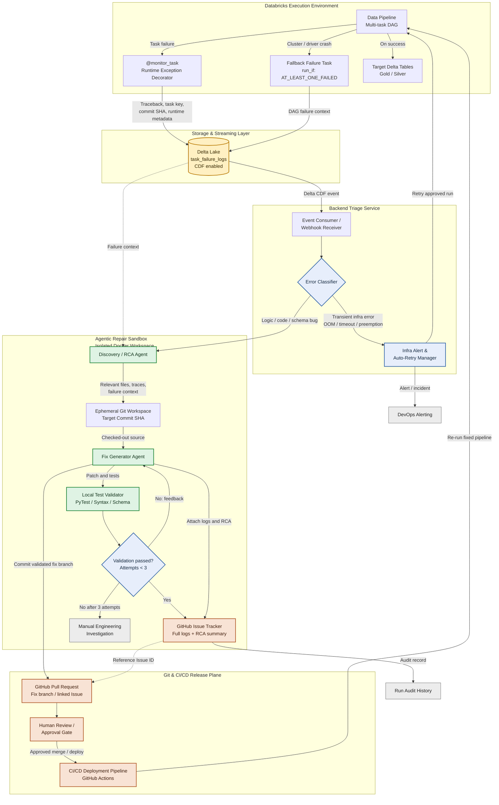

# Autonomous Pipeline Self-Healing & Triage System

**System name:** AutoHeal-DataEngine  
**System type:** Personal project HLD

## 1. Purpose

AutoHeal-DataEngine detects failures in Databricks data pipelines, classifies the failure, automatically retries recoverable infrastructure failures, and uses an isolated agentic repair workflow for deterministic code, data, or schema defects. Generated fixes are validated locally and delivered through GitHub and CI/CD with a human approval gate before production deployment.

### Design goals

- Capture task-level and end-of-DAG failure context with enough metadata to reproduce a failure.
- Dispatch failure events asynchronously through Delta Change Data Feed (CDF).
- Separate transient infrastructure failures from deterministic application failures.
- Generate and validate repairs against the configured GitHub base branch and supplied source commit metadata.
- Preserve a complete audit trail in Delta logs, GitHub Issues, pull requests, and CI/CD records.
- Keep production deployment behind deterministic validation and human approval.

## 2. Architecture Overview

### Boundary responsibilities

| Boundary                         | Responsibility                                                             | Primary state or interface               |
| -------------------------------- | -------------------------------------------------------------------------- | ---------------------------------------- |
| Databricks Execution Environment | Runs the multi-task DAG, writes target data, and intercepts failures       | Databricks Workflows, Delta tables       |
| Storage & Streaming Layer        | Durably stores failure events and emits incremental changes                | `task_failure_logs` Delta table with CDF |
| Backend Triage Service           | Consumes events, classifies failures, and manages infrastructure recovery  | CDF consumer or webhook endpoint         |
| Agentic Repair Sandbox           | Performs reproducible RCA, proposes fixes, and validates them in isolation | Ephemeral Docker workspace               |
| Git & CI/CD Release Plane        | Records the incident, proposes a change, and controls production release   | GitHub Issue, PR, Actions, HITL gate     |

## 3. Component Design

### 3.1 Databricks Execution Environment

#### Data Pipeline

The data pipeline is a multi-task Databricks Workflow DAG. Tasks perform ingestion and transformation work and publish validated results to Silver and Gold Delta layers on success.

Each task should expose stable metadata including:

- Workflow run ID and task run ID.
- Task key and upstream dependency status.
- Pipeline name and environment.
- Repository, branch, and deployed commit SHA.
- Cluster and runtime identifiers.
- Start time, end time, and duration.

#### Runtime Exception Decorator: `@monitor_task`

The decorator wraps task entry points and records uncaught exceptions with execution metadata. It must attempt to write failure state before re-raising the original exception so Databricks retains the native task failure semantics.

Captured fields should include:

- A unique `failure_event_id`.
- Error class, message, traceback, and normalized error signature.
- Workflow, run, task, and attempt identifiers.
- Commit SHA and repository metadata.
- Cluster, driver, executor, and runtime details where available.
- Input/output table references and schema version.
- Event timestamp and ingestion timestamp.

#### Fallback Failure Task

The end-of-DAG fallback task uses `run_if: AT_LEAST_ONE_FAILED`. It covers failures where the task-level decorator cannot execute, especially cluster startup, driver crash, executor loss, or abrupt process termination. It writes the available run-level context to the same failure log table and marks the context as `capture_mode = fallback`.

### 3.2 Storage and Streaming Layer

`task_failure_logs` is a Delta Lake table with Change Data Feed enabled. It is the durable handoff between data execution and asynchronous triage.

Logical schema:

| Column                                             | Purpose                                  |
| -------------------------------------------------- | ---------------------------------------- |
| `failure_event_id`                                 | Idempotency key for one recorded failure |
| `workflow_id`, `run_id`, `task_run_id`, `task_key` | Execution identity                       |
| `pipeline_name`, `environment`                     | Routing and policy context               |
| `error_class`, `error_message`, `traceback`        | Failure evidence                         |
| `error_signature`                                  | Stable grouping and deduplication key    |
| `commit_sha`, `repository`                         | Reproduction source                      |
| `cluster_id`, `runtime_version`                    | Infrastructure diagnosis                 |
| `input_tables`, `output_tables`                    | Data and schema context                  |
| `capture_mode`                                     | `decorator` or `fallback`                |
| `event_time`                                       | Event ordering and retention             |
| `triage_status`                                    | Processing state and auditability        |

The consumer must process CDF records idempotently. Duplicate notifications must not cause duplicate retries, issues, pull requests, or repair jobs.

### 3.3 Backend Triage Service

#### Event Consumer / Webhook Receiver

The service receives CDF changes asynchronously. Depending on the deployment model, this can be implemented as a scheduled Structured Streaming consumer, a queue-backed service, or a webhook receiver that accepts a notification and reads the corresponding Delta change.

Processing responsibilities:

1. Validate the event envelope.
2. Confirm the failure event exists and is readable.
3. Enforce idempotency using `failure_event_id` and `error_signature`.
4. Load the full failure context.
5. Pass a normalized event to the classifier.
6. Persist processing status and correlation IDs.

#### Error Classifier

The classifier is rule-based and deterministic in the first version. It produces a category, confidence or rule match, and recommended action.

| Category                          | Examples                                                                 | Action                                                  |
| --------------------------------- | ------------------------------------------------------------------------ | ------------------------------------------------------- |
| Transient infrastructure          | Cluster OOM, API timeout, spot preemption, temporary service unavailable | Alert and policy-controlled retry                       |
| Deterministic application failure | Python exception, failed assertion, invalid transformation logic         | Discovery and repair workflow                           |
| Data or schema failure            | Missing column, incompatible type, malformed input, contract violation   | Discovery and repair workflow, subject to schema policy |
| Unknown or unsafe                 | Ambiguous signature, security-sensitive change, repeated failure storm   | Alert and manual investigation                          |

#### Infra Alert and Auto-Retry Manager

The manager applies bounded retry policy for transient failures. It must enforce maximum attempts, exponential backoff, environment-specific retry limits, and a deduplication window. It sends an operational alert when retries are exhausted or when the failure pattern indicates a wider incident.

### 3.4 Agentic Repair Sandbox

The sandbox runs in an isolated Docker workspace with no write access to production systems. Network access should be disabled by default and explicitly allowlisted for source retrieval and required package registries.

#### Discovery / RCA Agent

The Discovery Agent assembles a structured diagnosis from the failure event, traceback, task metadata, deployed commit SHA, relevant repository files, recent related failures, and schema context. Its output is a bounded RCA summary containing:

- Reproduction hypothesis.
- Suspected source locations.
- Failure mechanism.
- Proposed repair scope.
- Tests that should prove or disprove the hypothesis.
- Risks and assumptions.

#### Ephemeral Git Workspace

The workspace clones and fetches the configured GitHub base branch into a Docker-visible temporary directory. It is destroyed after the run. The source revision and branch must be recorded in the issue and PR to preserve reproducibility.

#### Fix Generator Agent

The Fix Agent turns the RCA into a minimal patch. It may change application logic, tests, or explicitly approved schema evolution definitions. It must not modify deployment credentials, CI policy, branch protection, or unrelated files.

#### Local Test Validator

The validator runs deterministic checks inside the sandbox:

- Python syntax or compilation checks.
- Focused and repository unit tests with `pytest`.
- Lint and formatting checks such as `ruff` and `black` where configured.
- Input/output schema validation and contract tests.
- Relevant pipeline-specific tests.

The Fix Agent and validator form a feedback loop with a maximum of three attempts. Each attempt records the patch, command output, failing tests, and the next feedback context. A repair that fails the third attempt is escalated to manual engineering investigation and is not submitted for deployment.

### 3.5 Git and CI/CD Release Plane

#### GitHub Issue Tracker

A GitHub Issue is created for each repairable incident or deduplicated incident group. It includes the failure event ID, run links, full or securely referenced logs, traceback, RCA summary, target commit SHA, validator results, and risk classification.

#### GitHub Pull Request

The PR contains the validated fix branch and links back to the Issue. Its description includes the proposed change, reproduction details, tests executed, generated artifacts, and deployment considerations. The PR must identify whether schema evolution is involved.

#### Human Review and Approval Gate

A qualified engineer reviews the RCA, patch, test evidence, data impact, and security implications. Approval is required before merge or production deployment. Changes that touch schemas, access controls, or high-risk datasets should require additional ownership approval.

#### CI/CD Deployment Pipeline

GitHub Actions or the repository's existing CI/CD system reruns the full required checks, builds the deployable artifact, applies environment controls, and deploys only after the approval gate. On successful deployment, it re-runs the fixed Databricks pipeline with a new run correlation ID.

## 4. End-to-End Flows

### 4.1 Successful execution

1. The Data Pipeline completes all required DAG tasks.
2. Validated results are written to Silver and Gold Delta tables.
3. No failure event is generated.

### 4.2 Task-level failure

1. A task raises an exception.
2. `@monitor_task` captures the traceback and execution metadata.
3. The decorator writes a failure record to `task_failure_logs` and re-raises the exception.
4. Delta CDF emits the new record.
5. The Event Consumer loads and deduplicates the event.
6. The Error Classifier routes it to retry or repair.

### 4.3 Cluster or driver crash

1. The task process terminates before the decorator can persist context.
2. The fallback task runs because at least one DAG task failed.
3. The fallback writes available run-level and cluster-level context to `task_failure_logs`.
4. The normal CDF, consumer, and classifier flow continues.

### 4.4 Transient infrastructure failure

1. The classifier matches a known transient signature.
2. The Auto-Retry Manager checks retry budget and deduplication state.
3. The service emits a DevOps alert and retries the pipeline when policy permits.
4. Exhausted retries are escalated for manual investigation.

### 4.5 Deterministic repair workflow

1. The classifier routes a code, logic, data, or schema error to the Discovery Agent.
2. The agent gathers failure context and identifies relevant source files.
3. The workspace checks out the target commit SHA inside the isolated Docker sandbox.
4. The Fix Agent proposes a patch.
5. The Validator runs syntax, tests, lint, and schema checks.
6. On failure, validator feedback returns to the Fix Agent; this repeats for at most three attempts.
7. On success, the system creates or updates the GitHub Issue and opens a linked PR.
8. Human review and CI/CD checks control merge and deployment.
9. The fixed pipeline is re-run and the result is correlated to the original incident.

## 5. Reliability and Safety Controls

- **Idempotency:** Use `failure_event_id`, source commit SHA, and an incident key to prevent duplicate processing. Repair branch names include a UUID and tolerate rare GitHub reference collisions.
- **Bounded retries:** Apply maximum retry counts for both infrastructure recovery and agent repair.
- **Circuit breaker:** Pause automated repair when failure volume, repeated signatures, or sandbox errors exceed thresholds.
- **Least privilege:** Give the consumer, sandbox, GitHub App, and deployment identity only the permissions they need.
- **Isolation:** Run agents without production credentials; mount only the ephemeral workspace and approved test fixtures.
- **Secret handling:** Redact tokens, connection strings, personal data, and credentials before storing logs or opening GitHub artifacts.
- **Change scope:** Reject patches outside an allowlisted repository path or approved file types.
- **Schema protection:** Require explicit policy checks and data-owner approval for breaking or high-impact schema changes.
- **Auditability:** Correlate failure event, triage decision, sandbox attempt, Issue, PR, deployment, and rerun IDs.
- **Rollback:** Preserve the prior artifact and support rollback through the normal CI/CD release mechanism.

## 6. Observability and Operations

Track the following service-level metrics:

- Failure events captured by decorator versus fallback.
- CDF event lag and consumer processing latency.
- Classification counts by category and rule.
- Retry attempts, retry success rate, and exhausted retry count.
- Repair attempts per incident and validator pass rate.
- Time from failure to Issue, PR, approval, deployment, and successful rerun.
- Duplicate or suppressed events.
- Sandbox startup failures and resource consumption.
- Rollbacks and post-deployment regressions.

Every component should emit structured logs with a shared `correlation_id`. Alerts should cover CDF lag, consumer failures, retry storms, repeated repair failures, missing failure records, and deployment regressions.

## 7. Deployment Model

- Deploy the Backend Triage Service as a stateless, horizontally scalable service.
- Use a durable queue or checkpointed streaming consumer where event volume requires backpressure.
- Provision isolated Docker workers on demand for repair jobs and destroy them after completion.
- Store service configuration, classifier rules, retry policies, and allowlists in version-controlled configuration.
- Use separate identities and policies for development, staging, and production.
- Validate the complete flow in staging with synthetic task failures before enabling production automation.

## 8. Implementation Decisions

### Decisions

- Delta CDF is the primary failure-event handoff.
- The initial Error Classifier is deterministic and rules-based.
- Agent repairs are limited to isolated workspaces and three validator attempts.
- Human approval remains mandatory for release.

## 9. Build Checks

- A successful DAG run writes Silver and Gold outputs without creating a failure event.
- A task exception creates one idempotent `task_failure_logs` record containing traceback, task metadata, and commit SHA.
- A cluster or driver crash is represented by the fallback task when task-level interception is unavailable.
- A new failure record is consumed through Delta CDF and classified into the correct routing path.
- Transient failures follow bounded retry and alert policy.
- Deterministic failures reproduce against the target commit SHA in an isolated sandbox.
- The validator stops after three failed repair attempts and escalates the incident.
- A successful repair produces a GitHub Issue, linked PR, and recorded validation evidence.
- Production deployment cannot proceed without human approval and CI/CD success.
- The deployed fix triggers a correlated pipeline rerun with an auditable outcome.
